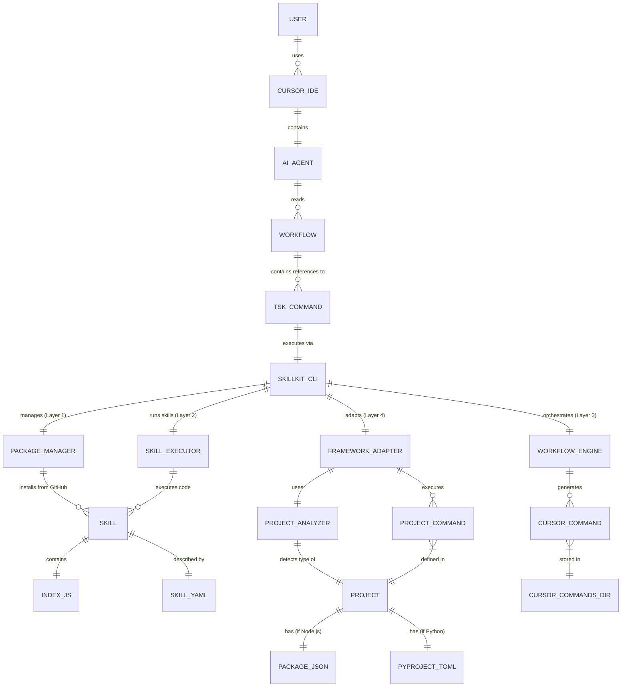
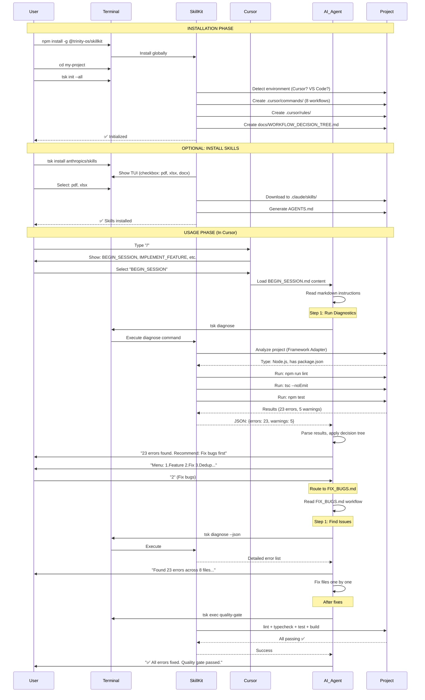
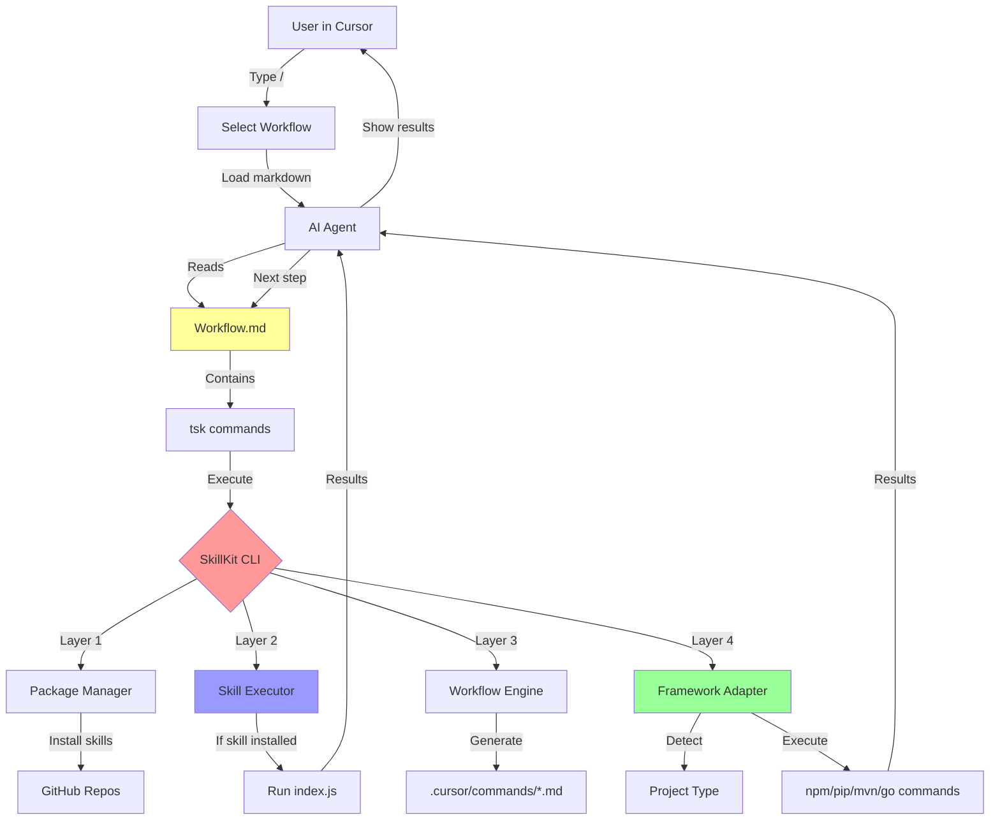

# SkillKit Complete System Flow

**The Integration Point:** Workflows orchestrate Skills + Framework Commands

---

## 🎯 How They Work Together

### The Reality:

1. **Workflows** (markdown) contain **instructions** that reference:
   - SkillKit commands (`tsk diagnose`, `tsk exec`)
   - Framework Adapters (which detect and run project commands)
   - Skills (when installed, via `tsk run <skill>`)

2. **Skills** are **optional add-ons** - specialized tools AI can use
3. **Framework Adapters** are the **core** - they auto-detect and run project commands

### Example Flow:

```markdown
# BEGIN_SESSION.md (Workflow)

## Step 1: Run Diagnostics
tsk diagnose
```

**What happens:**
1. AI reads workflow (markdown)
2. AI executes: `tsk diagnose`
3. SkillKit Framework Adapter detects project type
4. Adapter runs: `npm run lint`, `tsc`, `npm test` (or Python equivalents)
5. Results returned to AI
6. AI continues workflow

**Skills are NOT required** - the Framework Adapter is doing the work!

---

## 🔄 Entity Relationship Diagram



---

## 🚀 Complete User Flow (Install → Usage)



---

## 🔍 What's Actually Happening (The Truth)

### Scenario: User runs `@BEGIN_SESSION.md` in Cursor

**1. User Action:**
```
User types "/" in Cursor chat
User selects "BEGIN_SESSION"
```

**2. Cursor loads the workflow:**
```markdown
# BEGIN_SESSION.md
## Step 1: Run Diagnostics
tsk diagnose
```

**3. AI Agent executes:**
```bash
tsk diagnose
```

**4. SkillKit's Framework Adapter kicks in:**
```typescript
// Inside tsk diagnose:
const adapter = detectAdapter(projectRoot);
// → Detects: TypeScript project with package.json

await adapter.lint();      // → Runs: npm run lint (or eslint)
await adapter.typeCheck(); // → Runs: tsc --noEmit
await adapter.test();      // → Runs: npm test (or vitest)
```

**5. Results return to AI:**
```json
{
  "errors": 23,
  "warnings": 5,
  "tests": "12 passed, 2 failed"
}
```

**6. AI continues workflow:**
- Shows menu
- Makes routing decision
- Executes next workflow

### Where Do Skills Fit?

**Skills are OPTIONAL specialized tools:**

```markdown
# Example: Advanced workflow using skills

## Step 1: Basic diagnostics
tsk diagnose
# → Uses Framework Adapter (no skill needed)

## Step 2: Transform API response data
tsk run data-transformer --input response.json
# → Uses built-in SKILL

## Step 3: Run custom command
tsk run command-runner --input '{"command": "git", "args": ["status"]}'
# → Uses built-in SKILL
```

**Without skills installed:**
- Workflows still work
- Framework Adapters handle basic commands
- AI uses standard tools

**With skills installed:**
- Workflows can do MORE
- Specialized tools available
- Extended capabilities

---

## 🏗️ System Architecture Flow



---

## 💡 The Integration Layers

### Layer 1: Package Manager
```bash
tsk install anthropics/skills
```
**Purpose:** Get specialized skills from GitHub (OPTIONAL)

### Layer 2: Skill Executor
```bash
tsk run pdf-extract --input doc.pdf
```
**Purpose:** Execute installed skills (OPTIONAL, only if skills installed)

### Layer 3: Workflow Orchestrator
```bash
tsk init --all
# → Creates .cursor/commands/BEGIN_SESSION.md
```
**Purpose:** Generate AI-readable workflows (CORE - always used)

### Layer 4: Framework Adapter
```bash
tsk diagnose
# → Auto-detects project, runs lint/test/build
```
**Purpose:** Auto-adapt to any project type (CORE - always used)

---

## 🎯 What User Actually Experiences

### Minimal Setup (No Skills):

```bash
# 1. Install SkillKit
npm install -g @trinity-os/skillkit

# 2. Initialize in project
cd my-project
tsk init --all

# 3. In Cursor: "/" → "BEGIN_SESSION"
# → AI runs diagnostics via Framework Adapter
# → AI shows menu, routes to workflows
# → Everything works WITHOUT installing skills
```

### With Skills (Extended):

```bash
# 1-2. Same as above

# 3. Install specialized skills
tsk install anthropics/skills
# → Select: pdf, xlsx, docx

# 4. In Cursor: Workflows can now use skills
# @BEGIN_SESSION.md can call:
# - tsk diagnose (Framework Adapter)
# - tsk run pdf-extract (Skill)
# - tsk run xlsx-create (Skill)
```

---

## 🔄 Complete Interaction Flow

```mermaid
flowchart TB
    Start([User Opens Cursor]) --> Type["Type '/' in chat"]
    Type --> Select[Select BEGIN_SESSION]
    
    Select --> Load[AI loads BEGIN_SESSION.md]
    Load --> Read[AI reads workflow instructions]
    
    Read --> Step1{Step 1: tsk diagnose}
    
    Step1 --> CLI1[Execute: tsk diagnose]
    CLI1 --> Detect[Framework Adapter detects project]
    Detect --> RunLint[Run: npm run lint]
    RunLint --> RunTypes[Run: tsc]
    RunTypes --> RunTests[Run: npm test]
    RunTests --> Results1[Return: errors=23, warnings=5]
    
    Results1 --> AI_Parse[AI parses results]
    AI_Parse --> Decision{ERROR_COUNT > 50?}
    
    Decision -->|Yes| ForceRoute[Force route to FIX_BUGS]
    Decision -->|No| ShowMenu[Show menu to user]
    
    ShowMenu --> UserChoice{User picks option}
    
    UserChoice -->|1| Feature[Load IMPLEMENT_FEATURE.md]
    UserChoice -->|2| Bugs[Load FIX_BUGS.md]
    UserChoice -->|3| Dedup[Load DEDUP.md]
    
    Feature --> FeatureStep1{Step 1: Check health}
    FeatureStep1 --> CLI2[Execute: tsk diagnose --json]
    
    Bugs --> BugStep1{Step 1: Find issues}
    BugStep1 --> CLI3[Execute: tsk diagnose --json]
    
    CLI2 --> Adapt2[Framework Adapter runs checks]
    CLI3 --> Adapt3[Framework Adapter runs checks]
    
    Adapt2 --> FeatureStep2[Step 2: Detect architecture]
    FeatureStep2 --> CLI4[Execute: tsk discover]
    CLI4 --> Analyzer[Project Analyzer reads configs]
    Analyzer --> Patterns[Returns: TDD, contracts-first, etc.]
    
    Patterns --> FeatureStep3[Step 3: Implement code]
    FeatureStep3 --> AICode[AI writes code following patterns]
    AICode --> FeatureStep4[Step 4: Validate]
    
    FeatureStep4 --> CLI5[Execute: tsk exec quality-gate]
    CLI5 --> QualityGate[Run: lint + typecheck + test + build]
    QualityGate --> Pass{All pass?}
    
    Pass -->|Yes| Complete[✅ Feature complete]
    Pass -->|No| FeatureStep3
    
    Adapt3 --> BugStep2[Step 2: Prioritize errors]
    BugStep2 --> BugStep3[Step 3: Fix one by one]
    BugStep3 --> CLI6[After each fix: tsk exec lint]
    CLI6 --> Verify{Fixed?}
    
    Verify -->|Yes| MoreBugs{More bugs?}
    Verify -->|No| BugStep3
    
    MoreBugs -->|Yes| BugStep3
    MoreBugs -->|No| FinalCheck[Execute: tsk exec quality-gate]
    FinalCheck --> BugComplete[✅ All bugs fixed]
    
    style Start fill:#e1f5e1
    style Complete fill:#e1f5e1
    style BugComplete fill:#e1f5e1
    style CLI1 fill:#ffe1e1
    style CLI2 fill:#ffe1e1
    style CLI3 fill:#ffe1e1
    style CLI4 fill:#ffe1e1
    style CLI5 fill:#ffe1e1
    style CLI6 fill:#ffe1e1
    style Detect fill:#e1e1ff
    style Analyzer fill:#e1e1ff
```



---

## 🤔 Your Questions Answered

### Q: "Are these two standalone systems?"

**A:** No! They're **integrated layers**:
- **Workflows** = Instructions (markdown)
- **Skills** = Optional tools (code)
- **Framework Adapters** = Core execution (always used)

Workflows **orchestrate** both Skills and Framework Adapters.

### Q: "What's the add-on of skills?"

**A:** Skills add **specialized capabilities** that Framework Adapters don't provide:

**Framework Adapters provide:**
- lint, typecheck, test, build (project basics)

**Skills add:**
- PDF extraction
- Excel creation
- API integrations
- Custom data transformations
- Domain-specific tools

**Example:**
```markdown
## Step 1: Basic checks
tsk diagnose          # Framework Adapter

## Step 2: Extract API docs from PDF
tsk run pdf-extract   # Skill (specialized)

## Step 3: Generate client code
tsk run openapi-gen   # Skill (specialized)
```

### Q: "How does it work post-install?"

**See the sequence diagram above** - the complete flow from `npm install` → usage in Cursor.

---

## 🎯 Summary: The Integration

### What Actually Happens:

1. **You install SkillKit:**
   ```bash
   npm install -g @trinity-os/skillkit
   ```

2. **You initialize in project:**
   ```bash
   tsk init --all
   ```
   - Creates `.cursor/commands/*.md` (workflows)
   - Creates `.cursor/rules/` (agent instructions)

3. **In Cursor, you select a workflow:**
   ```
   Type "/" → Select "BEGIN_SESSION"
   ```

4. **AI reads the workflow markdown:**
   ```markdown
   ## Step 1: tsk diagnose
   ```

5. **AI executes SkillKit commands:**
   - Framework Adapter auto-detects project
   - Runs appropriate commands (`npm run lint`, etc.)
   - Returns results

6. **AI follows workflow logic:**
   - Makes routing decisions
   - Shows menus
   - Continues to next workflow

7. **(Optional) If skills installed:**
   - Workflows can also call: `tsk run <skill>`
   - Skills execute specialized code
   - Results return to AI

### No Collision - Clean Integration!

- **Workflows** = The script
- **Framework Adapters** = The core actors
- **Skills** = The guest stars (optional)

All working together through the `tsk` CLI! 🎯

