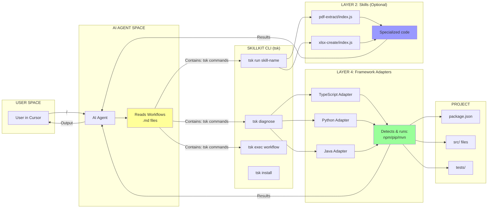
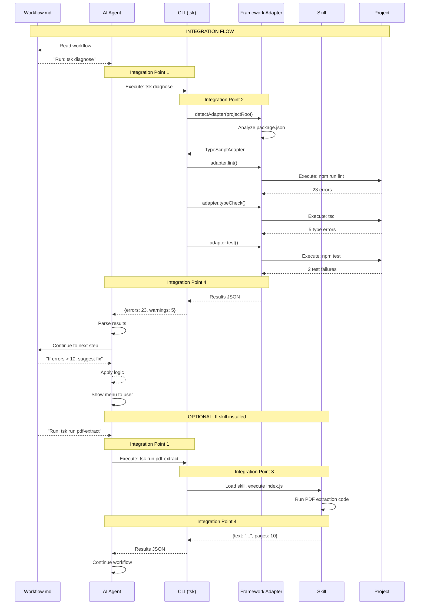

# SkillKit Integration Points

**Question:** Where do Workflows, Skills, and Framework Adapters interact?

---

## 🎯 The Integration Matrix



---

## 🔗 Integration Point 1: Workflows → CLI

**Location:** Inside workflow markdown files

**Example:**
```markdown
# BEGIN_SESSION.md

## Step 1: Run Diagnostics
bash
tsk diagnose     ← INTEGRATION POINT
```

**What happens:**
- AI reads `tsk diagnose` from markdown
- AI executes the command in terminal
- CLI receives the command

---

## 🔗 Integration Point 2: CLI → Framework Adapters

**Location:** Inside CLI commands (e.g., `diagnose.ts`)

**Code:**
```typescript
// src/cli-commands/diagnose.ts
const adapter = await detectAdapter(projectRoot);
await adapter.lint();       ← INTEGRATION POINT
await adapter.typeCheck();  ← INTEGRATION POINT
await adapter.test();       ← INTEGRATION POINT
```

**What happens:**
- CLI detects project type
- Calls appropriate adapter methods
- Adapter runs project commands

---

## 🔗 Integration Point 3: CLI → Skills

**Location:** Inside `run` command

**Code:**
```typescript
// src/cli-commands/run.ts
const skill = await registry.loadFromDirectory(skillPath);
const executor = new SkillExecutor(skill);
const result = await executor.execute(input);  ← INTEGRATION POINT
```

**What happens:**
- CLI loads skill from disk
- Executes skill's `index.js`
- Returns result to AI

---

## 🔗 Integration Point 4: Results → AI Agent

**Location:** Terminal output / JSON

**Example:**
```json
{
  "errors": 23,
  "warnings": 5,
  "tests": {
    "passed": 12,
    "failed": 2
  }
}
```

**What happens:**
- Framework Adapter or Skill returns data
- AI agent parses the output
- AI continues workflow based on results

---

## 📊 Data Flow Visualization



---

## 🎭 The Three Actors

### 1. Workflows (The Script)

**File:** `.cursor/commands/BEGIN_SESSION.md`

**Contains:**
```markdown
## Step 1
tsk diagnose

## Step 2
tsk run pdf-extract
```

**Role:** Tells AI what to do

**Integration:** References `tsk` commands

---

### 2. Framework Adapters (Core Actors - Always Present)

**Files:** 
- `src/adapters/typescript.ts`
- `src/adapters/python.ts`

**Contains:**
```typescript
class TypeScriptAdapter {
  async lint() {
    return this.executeCommand('npm', ['run', 'lint']);
  }
}
```

**Role:** Executes project commands

**Integration:** Called by CLI commands

---

### 3. Skills (Guest Stars - Optional)

**Files:** 
- `.claude/skills/pdf-extract/index.js`
- `.claude/skills/xlsx-create/index.js`

**Contains:**
```javascript
module.exports = async (input) => {
  return { text: await extractPDF(input.file) };
};
```

**Role:** Specialized tools

**Integration:** Called by `tsk run`

---

## 🔍 Where Things Could Collide (But Don't)

### Potential Collision 1: Command Names

**Problem:** What if workflow says `tsk run lint`?

**Resolution:**
- `tsk run` = Execute a SKILL named "lint"
- `tsk exec lint` = Execute framework adapter's lint
- `tsk diagnose` = Run all checks (lint + typecheck + test)

Different commands, no collision! ✅

---

### Potential Collision 2: Same Task, Different Layer

**Problem:** Both adapters and skills can run tests?

**Resolution:**
- **Framework Adapter:** `tsk diagnose` → Runs standard project tests
- **Skill:** `tsk run test-generator` → Generates NEW tests (different purpose)

Different responsibilities! ✅

---

### Potential Collision 3: Output Format

**Problem:** How does AI know if output is from adapter or skill?

**Resolution:**
- Both return structured JSON
- Both have clear error handling
- Workflows don't care about source, just results

Consistent interface! ✅

---

## 🎯 Real Example: Full Integration

### Workflow File: `.cursor/commands/IMPLEMENT_FEATURE.md`

```markdown
# Implement Feature

## Phase 1: Check Health
bash
tsk diagnose
```
**Integration Point 1:** Workflow → CLI

---

### CLI Executes: `src/cli-commands/diagnose.ts`

```typescript
const adapter = await detectAdapter(projectRoot);
const lintResult = await adapter.lint();
const typeResult = await adapter.typeCheck();
const testResult = await adapter.test();
```
**Integration Point 2:** CLI → Framework Adapter

---

### Adapter Runs: `src/adapters/typescript.ts`

```typescript
async lint() {
  if (this.scripts['lint']) {
    return this.executeCommand('npm', ['run', 'lint']);
  }
  return this.executeCommand('eslint', ['src/']);
}
```
**Integration Point 3:** Adapter → Project Commands

---

### Results Return:

```json
{
  "lint": { "errors": 23, "warnings": 5 },
  "typecheck": { "errors": 5 },
  "test": { "passed": 12, "failed": 2 }
}
```
**Integration Point 4:** Results → AI Agent

---

### AI Continues Workflow:

```markdown
## Phase 2: If Errors > 20
Route to @FIX_BUGS.md
```
**Integration Point 5:** AI Decision Logic

---

## 📋 Integration Checklist

### ✅ What's Connected:

- [x] Workflows reference CLI commands
- [x] CLI commands call Framework Adapters
- [x] CLI commands can call Skills (if installed)
- [x] All return JSON to AI
- [x] AI uses results to continue workflows

### ✅ What's Separate:

- [x] Workflows are markdown (not code)
- [x] Skills are optional (not required)
- [x] Framework Adapters are independent (don't know about skills)
- [x] Each layer has clear boundaries

### ✅ No Collisions:

- [x] Different command names (`run` vs `exec` vs `diagnose`)
- [x] Different purposes (adapters = basics, skills = specialized)
- [x] Consistent interfaces (all return JSON)
- [x] Clear separation of concerns

---

## 🚀 Summary

### The Integration is Clean:

```
Workflows (markdown)
    ↓ (references tsk commands)
CLI (tsk)
    ↓ (calls adapters for basics)
Framework Adapters
    ↓ (executes project commands)
Project (npm/pip/mvn)
    ↓ (returns results)
AI Agent
    ↓ (continues workflow)
Workflows (next step)
```

### Plus Optional Skills:

```
Workflows (markdown)
    ↓ (can also reference tsk run)
CLI (tsk)
    ↓ (loads and executes skills)
Skills (index.js)
    ↓ (runs specialized code)
AI Agent
    ↓ (uses results)
Workflows (next step)
```

### No Collision Because:

1. **Different commands** - `run` vs `exec` vs `diagnose`
2. **Different purposes** - basics vs specialized
3. **Clear layers** - orchestration → execution → adaptation
4. **Consistent interfaces** - all return JSON
5. **Optional vs Required** - adapters always work, skills enhance

**Everything works together through the `tsk` CLI!** 🎯

